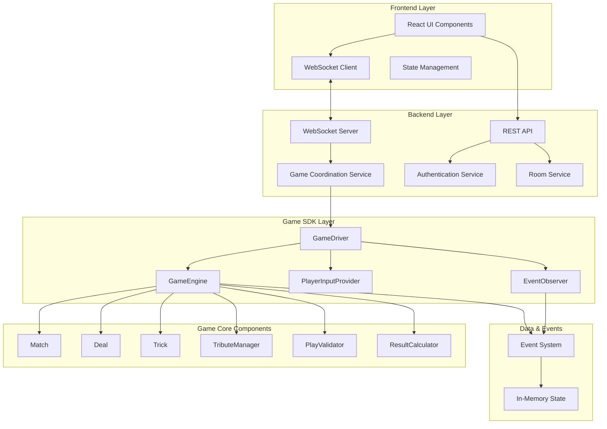

# Design Document

## Overview

掼蛋在线对战平台采用分层架构设计，将游戏逻辑完全封装在独立的SDK中，通过事件驱动的方式与Web服务层进行通信。系统支持四人在线对战，提供完整的用户管理、房间管理、实时游戏体验。

### 核心设计原则

1. **游戏逻辑与服务分离**: 所有掼蛋游戏规则和状态管理都在SDK中实现，Web服务层仅负责协调和通信
2. **事件驱动架构**: 使用事件系统实现松耦合的组件通信
3. **状态一致性**: 通过单一数据源确保游戏状态的一致性
4. **实时性**: 基于WebSocket实现低延迟的实时游戏体验
5. **容错性**: 支持断线重连和自动托管机制

## Architecture

基于实际SDK实现的分层架构设计：

### 系统架构图



### 核心架构特点

#### 1. GameDriver驱动模式
- **完整游戏循环封装**: GameDriver封装了整个比赛的运行逻辑，从StartMatch到MatchEnd
- **输入输出分离**: 通过PlayerInputProvider接口将游戏逻辑与输入来源解耦
- **事件观察模式**: 通过EventObserver接口实现游戏状态的观察和响应
- **超时控制**: 内置超时机制，支持30秒出牌超时、20秒贡牌超时

#### 2. 三层状态管理
- **Match层**: 管理整个比赛生命周期，包括队伍等级、玩家状态
- **Deal层**: 管理单局游戏，包括发牌、贡牌、出牌流程
- **Trick层**: 管理单轮出牌，包括牌型验证、轮次控制

#### 3. 事件驱动通信
- **20+种游戏事件**: 涵盖比赛开始、发牌、贡牌各阶段、出牌、结算等
- **同步事件处理**: 确保事件按顺序处理，保证状态一致性
- **观察者模式**: 支持多个观察者同时监听游戏事件

### 分层职责

#### Frontend Layer (React + TypeScript)
- **UI Components**: 游戏界面渲染和用户交互
- **WebSocket Client**: 实时通信管理，接收游戏事件
- **State Management**: 客户端状态管理和同步
- **Game Preparation**: 处理游戏开始前的准备页面和倒计时

#### Backend Layer (Go)
- **REST API**: 用户认证、房间管理等HTTP接口
- **WebSocket Server**: 实时消息路由和广播
- **Game Coordination Service**: 协调多个GameDriver实例，处理房间级别的逻辑
- **Game Start Flow**: 管理游戏开始流程，包括准备页面和倒计时同步

#### Game SDK Layer (Go)
基于实际实现的核心组件：

- **GameDriver**: 
  - 游戏循环控制器，封装完整的比赛运行逻辑
  - 协调GameEngine和PlayerInputProvider
  - 管理事件观察者，处理超时控制
  
- **GameEngine**: 
  - 游戏状态管理核心，维护Match/Deal/Trick三层状态
  - 事件发布中心，支持20+种游戏事件
  - 提供完整的游戏操作接口
  
- **PlayerInputProvider**: 
  - 玩家输入抽象接口，支持AI、人工、网络等多种输入源
  - 处理出牌决策、贡牌选择、还贡等玩家操作
  
- **EventObserver**: 
  - 事件观察接口，用于日志记录、统计分析、UI更新
  - 支持同步/异步事件处理模式

#### Game Core Components (Go)
- **Match/Deal/Trick**: 三层游戏状态实体
- **TributeManager**: 独立的贡牌逻辑处理器
- **PlayValidator**: 出牌合法性验证器
- **ResultCalculator**: 游戏结果和统计计算器

## Components and Interfaces

### 核心组件设计

#### 1. Game Engine (游戏引擎)

基于实际SDK实现，GameEngine是核心的游戏管理组件，实现了完整的GameEngineInterface接口：

```go
type GameEngineInterface interface {
    // 生命周期管理
    StartMatch(players []Player) error
    StartDeal() error
    
    // 游戏操作
    PlayCards(playerSeat int, cards []*Card) (*GameEvent, error)
    PassTurn(playerSeat int) (*GameEvent, error)
    
    // 贡牌系统 - 基于TributeManager实现
    ProcessTributePhase() (*TributeAction, error)
    SubmitTributeSelection(playerID int, cardID string) error
    SubmitReturnTribute(playerID int, cardID string) error
    SkipTributeAction() error
    GetTributeStatus() *TributeStatusInfo
    
    // 状态查询 - 提供多层次的状态访问
    GetGameState() *GameState
    GetPlayerView(playerSeat int) *PlayerGameState
    GetCurrentDealStatus() DealStatus
    GetCurrentTurnInfo() *TurnInfo
    GetMatchDetails() *MatchDetails
    IsGameFinished() bool
    
    // 事件处理 - 支持20+种游戏事件
    RegisterEventHandler(eventType GameEventType, handler GameEventHandler)
    ProcessTimeouts() []*GameEvent
    
    // 玩家管理 - 支持断线重连和自动托管
    HandlePlayerDisconnect(playerSeat int) (*GameEvent, error)
    HandlePlayerReconnect(playerSeat int) (*GameEvent, error)
    SetPlayerAutoPlay(playerSeat int, enabled bool) error
}
```

**实际实现特点**:
- **事件驱动架构**: 支持20+种游戏事件类型，包括比赛开始、发牌、贡牌各阶段、出牌、轮次结束等
- **分层状态管理**: Match -> Deal -> Trick 三层状态结构，每层都有独立的状态机
- **贡牌系统集成**: 通过TributeManager处理复杂的贡牌逻辑，支持双下选牌、抗贡等规则
- **自动托管**: 支持断线自动托管，托管策略为首出最小牌，跟牌则Pass
- **超时处理**: 内置20秒操作超时，支持自动Pass或自动出牌
- **状态同步**: 提供玩家视角的状态过滤，确保手牌隐私

#### 2. GameDriver System (游戏驱动系统)

基于实际SDK实现的GameDriver架构：

```go
type GameDriver struct {
    engine        GameEngineInterface // 游戏引擎接口
    inputProvider PlayerInputProvider // 玩家输入提供者
    observers     []EventObserver     // 事件观察者列表
    config        *GameDriverConfig   // 驱动器配置
}

type PlayerInputProvider interface {
    RequestPlayDecision(ctx context.Context, playerSeat int, hand []*Card, trickInfo *TrickInfo) (*PlayDecision, error)
    RequestTributeSelection(ctx context.Context, playerSeat int, options []*Card) (*Card, error)
    RequestReturnTribute(ctx context.Context, playerSeat int, hand []*Card) (*Card, error)
}

type EventObserver interface {
    OnGameEvent(event *GameEvent)
}

type GameDriverConfig struct {
    PlayDecisionTimeout  time.Duration // 30秒出牌超时
    TributeTimeout       time.Duration // 20秒贡牌超时
    MaxConcurrentPlayers int           // 最大并发玩家数
    AsyncEventHandling   bool          // 事件处理模式
}
```

**设计特点**:
- **完整游戏循环**: RunMatch方法封装了从比赛开始到结束的完整流程
- **输入抽象化**: 通过PlayerInputProvider接口支持AI、人工、网络等多种输入源
- **事件观察**: 通过EventObserver接口实现游戏状态的观察和响应
- **超时控制**: 内置超时机制，防止游戏卡死
- **错误处理**: 完善的错误处理和状态验证机制

#### 3. Room List Management (房间列表管理)

**设计决策**: 基于需求2的具体要求，实现高效的房间列表管理

```go
type RoomListManager struct {
    rooms map[string]*Room
    mutex sync.RWMutex
}

func (rlm *RoomListManager) GetSortedRooms(page, limit int) (*RoomListResponse, error) {
    // 排序逻辑：优先显示等待中房间，按已加入人数降序排列
    // 分页逻辑：每页最多12个房间
}

type RoomSortCriteria struct {
    PriorityOrder []RoomStatus // [RoomStatusWaiting, RoomStatusReady, RoomStatusPlaying]
    PlayerCountDesc bool        // 按人数降序
}
```

**房间列表特性**:
- **智能排序**: 等待中房间优先显示，便于玩家快速找到可加入的房间
- **人数排序**: 相同状态房间按已加入人数降序，优先显示接近满员的房间
- **分页加载**: 每页12个房间，支持大量房间时的性能优化
- **实时更新**: 房间状态变化时实时更新列表显示

#### 4. WebSocket Message System (消息系统)

```go
type WSMessage struct {
    Type      string      `json:"type"`
    Data      interface{} `json:"data"`
    Timestamp time.Time   `json:"timestamp"`
    PlayerID  string      `json:"player_id,omitempty"`
}

// 基于GameEvent的消息类型定义
const (
    // 房间管理
    MSG_JOIN_ROOM    = "join_room"
    MSG_LEAVE_ROOM   = "leave_room"
    MSG_START_GAME   = "start_game"
    
    // 游戏开始流程 - 支持需求4
    MSG_GAME_PREPARE     = "game_prepare"     // 进入准备页面
    MSG_COUNTDOWN        = "countdown"        // 3秒倒计时
    MSG_GAME_BEGIN       = "game_begin"       // 正式开始游戏
    
    // 游戏操作 - 对应PlayerInputProvider接口
    MSG_PLAY_DECISION    = "play_decision"     // 出牌决策请求
    MSG_TRIBUTE_SELECT   = "tribute_select"   // 贡牌选择请求
    MSG_TRIBUTE_RETURN   = "tribute_return"   // 还贡请求
    
    // 状态同步 - 基于GameEvent
    MSG_GAME_EVENT       = "game_event"       // 游戏事件广播
    MSG_PLAYER_VIEW      = "player_view"      // 玩家视角状态
    MSG_ROOM_UPDATE      = "room_update"      // 房间状态更新
    
    // 超时和托管 - 支持需求10和需求11
    MSG_PLAYER_TIMEOUT   = "player_timeout"   // 玩家操作超时
    MSG_AUTO_PLAY        = "auto_play"        // 托管状态变更
    MSG_RECONNECT        = "reconnect"        // 断线重连
)
```

#### 3. Room Management System (房间管理)

```go
type Room struct {
    ID          string     `json:"id"`
    Status      RoomStatus `json:"status"`
    Players     [4]*Player `json:"players"`
    Owner       string     `json:"owner"`
    GameEngine  *GameEngine `json:"-"`
    CreatedAt   time.Time  `json:"created_at"`
}

type RoomStatus int
const (
    RoomStatusWaiting RoomStatus = iota  // 等待玩家加入
    RoomStatusReady                      // 4人已满，可以开始
    RoomStatusPlaying                    // 游戏进行中
    RoomStatusClosed                     // 房间已关闭
)

type RoomService interface {
    CreateRoom(ownerID string) (*Room, error)
    JoinRoom(roomID, playerID string) error
    LeaveRoom(roomID, playerID string) error
    ListRooms(page, limit int) ([]*Room, error)
    StartGame(roomID, playerID string) error
    
    // 房间列表管理 - 支持需求2的分页和排序
    GetRoomList(page, limit int) (*RoomListResponse, error)
    GetRoomDetails(roomID string) (*Room, error)
    
    // 房主权限管理 - 支持需求3的房主转移
    TransferOwnership(roomID, currentOwner, newOwner string) error
    AutoSelectNewOwner(roomID string) error
}

type RoomListResponse struct {
    Rooms      []*RoomInfo `json:"rooms"`
    TotalCount int         `json:"total_count"`
    Page       int         `json:"page"`
    Limit      int         `json:"limit"`
}

type RoomInfo struct {
    ID          string     `json:"id"`
    Status      RoomStatus `json:"status"`
    PlayerCount int        `json:"player_count"`
    Players     []*Player  `json:"players"`
    Owner       string     `json:"owner"`
    CanJoin     bool       `json:"can_join"`
}
```

**设计决策**:
- **房间状态管理**: 明确定义房间的4种状态，支持需求2和需求3中的状态判断
- **分页支持**: 实现需求2中的分页加载功能，每页最多12个房间
- **排序逻辑**: 优先显示等待中房间，按已加入人数降序排列
- **权限控制**: CanJoin字段支持需求2中的按钮状态控制（可点击/置灰）
- **房主管理**: 支持需求3中房主退出时的自动转移和房间自动关闭逻辑

#### 4. Authentication System (认证系统)

```go
type AuthService interface {
    Register(username, password string) (*User, error)
    Login(username, password string) (*AuthToken, error)
    ValidateToken(token string) (*User, error)
    Logout(token string) error
}

type User struct {
    ID       string `json:"id"`
    Username string `json:"username"`
    Online   bool   `json:"online"`
}

type AuthToken struct {
    Token     string    `json:"token"`
    ExpiresAt time.Time `json:"expires_at"`
    UserID    string    `json:"user_id"`
}
```

## Data Models

### 游戏状态模型

基于SDK实际实现的三层状态结构：

#### 1. Match (比赛) - 完整比赛管理
```go
type Match struct {
    ID          string      `json:"id"`
    Status      MatchStatus `json:"status"`      // waiting/playing/finished
    Players     [4]*Player  `json:"players"`     // 固定4个玩家位置
    CurrentDeal *Deal       `json:"current_deal"`
    DealHistory []*Deal     `json:"deal_history"`
    TeamLevels  [2]int      `json:"team_levels"` // 两队等级，初始都是2
    Winner      int         `json:"winner"`      // -1表示未结束，0/1表示获胜队伍
    StartTime   time.Time   `json:"start_time"`
    EndTime     *time.Time  `json:"end_time,omitempty"`
    Duration    time.Duration `json:"duration"`   // 比赛总时长，支持需求8统计
}
```

**Match核心功能**:
- 队伍管理：座位0,2为Team0，座位1,3为Team1
- 等级管理：根据Deal结果自动升级，达到A级(14)获胜
- 玩家状态：支持在线/离线、自动托管状态管理
- 统计信息：记录比赛时长和历史，支持需求8和需求9的结算显示

#### 2. Deal (牌局) - 单局游戏管理
```go
type Deal struct {
    ID           string        `json:"id"`
    Level        int           `json:"level"`        // 当前牌局等级
    Status       DealStatus    `json:"status"`       // waiting/dealing/tribute/playing/finished
    CurrentTrick *Trick        `json:"current_trick"`
    TrickHistory []*Trick      `json:"trick_history"`
    TributePhase *TributePhase `json:"tribute_phase,omitempty"` // 贡牌阶段
    PlayerCards  [4][]*Card    `json:"player_cards"`            // 每个玩家的手牌
    Rankings     []int         `json:"rankings"`                // 出完牌的顺序
    StartTime    time.Time     `json:"start_time"`
    EndTime      *time.Time    `json:"end_time,omitempty"`
    LastResult   *DealResult   `json:"-"`                       // 上局结果，用于贡牌判定
}
```

**Deal核心功能**:
- 发牌：每人27张牌，共108张（含大小王）
- 贡牌管理：基于上局结果自动处理贡牌逻辑
- 出牌顺序：基于贡牌结果确定首家
- 结算：自动计算胜负类型和升级
- 结算：自动计算胜负类型和升级

#### 3. Trick (轮次) - 单轮出牌管理
```go
type Trick struct {
    ID          string        `json:"id"`
    Leader      int           `json:"leader"`       // 当前领先玩家
    CurrentTurn int           `json:"current_turn"` // 当前轮到的玩家
    Plays       []*PlayAction `json:"plays"`        // 所有出牌动作
    Winner      int           `json:"winner"`       // 轮次获胜者
    LeadComp    CardComp      `json:"lead_comp"`    // 当前领先牌型
    Status      TrickStatus   `json:"status"`       // waiting/playing/finished
    StartTime   time.Time     `json:"start_time"`
    TurnTimeout time.Time     `json:"turn_timeout"` // 操作超时时间
    NextLeader  int           `json:"next_leader"`  // 下轮首家
}
```

**Trick核心功能**:
- 牌型验证：通过PlayValidator验证出牌合法性
- 轮次控制：自动轮转到下一玩家，处理Pass逻辑
- 超时处理：20秒超时自动Pass或出最小牌
- 特殊规则：支持队友优先权等掼蛋特色规则

#### 4. TributePhase (贡牌阶段) - 复杂贡牌逻辑
```go
type TributePhase struct {
    Status           TributeStatus `json:"status"`            // waiting/selecting/returning/finished
    TributeMap       map[int]int   `json:"tribute_map"`       // 贡牌映射：给予者->接收者
    TributeCards     map[int]*Card `json:"tribute_cards"`     // 实际贡牌
    ReturnCards      map[int]*Card `json:"return_cards"`      // 还贡牌
    PoolCards        []*Card       `json:"pool_cards"`        // 双下贡牌池
    SelectingPlayer  int           `json:"selecting_player"`  // 当前选牌玩家
    SelectTimeout    time.Time     `json:"select_timeout"`    // 选牌超时
    IsImmune         bool          `json:"is_immune"`         // 是否抗贡
    SelectionResults map[int]int   `json:"selection_results"` // 选牌结果追踪
}
```

**贡牌系统特点**:
- **抗贡机制**：败方持有2张及以上大王时免贡
- **双下处理**：rank1,rank2同队时，rank3,rank4贡牌到池，rank1优先选择
- **自动贡牌**：除红桃主牌外的最大牌自动上贡
- **还贡策略**：收贡方选择最小牌还贡
- **时间控制**：双下选择3秒超时，展示贡牌3秒，还贡公示3秒
- **界面展示**：清晰显示贡牌信息和操作界面，支持需求5的完整流程

### 用户和房间模型

#### 1. Player (玩家)
```go
type Player struct {
    ID       string `json:"id"`
    Username string `json:"username"`
    Seat     int    `json:"seat"`
    Online   bool   `json:"online"`
    AutoPlay bool   `json:"auto_play"`
}
```

#### 2. Room (房间)
```go
type Room struct {
    ID        string     `json:"id"`
    Status    RoomStatus `json:"status"`
    Players   [4]*Player `json:"players"`
    Owner     string     `json:"owner"`
    CreatedAt time.Time  `json:"created_at"`
}
```

## Error Handling

### 错误分类和处理策略

#### 1. 游戏规则错误
```go
type GameRuleError struct {
    Code    string `json:"code"`
    Message string `json:"message"`
    Details string `json:"details"`
}

// 错误代码定义
const (
    ERR_INVALID_PLAY     = "INVALID_PLAY"
    ERR_NOT_PLAYER_TURN  = "NOT_PLAYER_TURN"
    ERR_INVALID_CARDS    = "INVALID_CARDS"
    ERR_CANNOT_PASS      = "CANNOT_PASS"
)
```

#### 2. 网络和连接错误
- **断线处理**: 自动标记为托管状态，游戏继续进行
- **重连处理**: 恢复玩家状态，同步当前游戏状态
- **超时处理**: 自动执行Pass或最小牌出牌

#### 3. 系统错误
- **房间不存在**: 返回错误并重定向到大厅
- **权限错误**: 验证用户身份和操作权限
- **状态不一致**: 强制同步游戏状态

### 错误恢复机制

1. **客户端错误恢复**:
   - 自动重连机制
   - 状态同步和恢复
   - 用户友好的错误提示

2. **服务端错误恢复**:
   - 游戏状态快照和恢复
   - 事务性操作确保一致性
   - 日志记录和监控

## Testing Strategy

### 测试层次和策略

#### 1. 单元测试 (Unit Tests)
- **SDK组件测试**: 每个游戏组件的独立功能测试
- **业务逻辑测试**: 掼蛋规则和状态转换测试
- **工具函数测试**: 牌型识别、比较等工具函数测试

```go
func TestGameEngine_StartMatch(t *testing.T) {
    engine := NewGameEngine()
    players := []Player{
        {ID: "p1", Username: "player1", Seat: 0},
        {ID: "p2", Username: "player2", Seat: 1},
        {ID: "p3", Username: "player3", Seat: 2},
        {ID: "p4", Username: "player4", Seat: 3},
    }
    
    err := engine.StartMatch(players)
    assert.NoError(t, err)
    assert.Equal(t, GameStatusStarted, engine.GetGameState().Status)
}
```

#### 2. 集成测试 (Integration Tests)
- **API端点测试**: REST API和WebSocket接口测试
- **服务集成测试**: 各服务组件间的协作测试
- **数据库集成测试**: 数据持久化和查询测试

#### 3. 端到端测试 (E2E Tests)
- **完整游戏流程测试**: 从登录到游戏结束的完整流程
- **多用户并发测试**: 模拟多个用户同时游戏
- **断线重连测试**: 网络异常情况下的系统行为

#### 4. 性能测试 (Performance Tests)
- **并发用户测试**: 支持的最大并发用户数
- **WebSocket性能测试**: 消息传输延迟和吞吐量
- **内存使用测试**: 长时间运行的内存泄漏检测

### 测试数据和场景

#### 1. 游戏场景测试数据
```go
// 测试用的标准牌局配置
var TestDealConfigs = []struct {
    Name        string
    Level       int
    PlayerCards [4][]*Card
    Expected    DealResult
}{
    {
        Name:  "双下胜利",
        Level: 5,
        // ... 具体的牌配置
    },
}
```

#### 2. 边界条件测试
- 最小/最大牌型组合
- 极端超时情况
- 网络异常场景
- 并发操作冲突

### 自动化测试流程

1. **持续集成**: 每次代码提交自动运行单元测试和集成测试
2. **定期回归测试**: 每日运行完整的端到端测试套件
3. **性能基准测试**: 定期运行性能测试并记录基准数据
4. **测试覆盖率监控**: 维持90%以上的代码覆盖率

## SDK使用模式

基于match_simulator_v2.go的实际使用模式：

### 1. 基本使用流程

```go
// 1. 创建游戏引擎
engine := sdk.NewGameEngine()

// 2. 创建游戏驱动器
driver := sdk.NewGameDriver(engine, sdk.DefaultGameDriverConfig())

// 3. 设置输入提供者
inputProvider := NewWebSocketInputProvider() // 或其他实现
driver.SetInputProvider(inputProvider)

// 4. 添加事件观察者
observer := NewGameObserver()
driver.AddObserver(observer)

// 5. 运行比赛
players := []sdk.Player{...} // 4个玩家
result, err := driver.RunMatch(players)
```

### 2. 输入提供者实现

```go
type WebSocketInputProvider struct {
    connections map[int]*websocket.Conn
}

func (wip *WebSocketInputProvider) RequestPlayDecision(
    ctx context.Context, 
    playerSeat int, 
    hand []*sdk.Card, 
    trickInfo *sdk.TrickInfo,
) (*sdk.PlayDecision, error) {
    // 发送出牌请求到客户端
    request := PlayDecisionRequest{
        PlayerSeat: playerSeat,
        Hand:       hand,
        TrickInfo:  trickInfo,
    }
    
    // 等待客户端响应（带超时）
    response, err := wip.waitForResponse(ctx, playerSeat, request)
    if err != nil {
        return nil, err
    }
    
    return response.Decision, nil
}
```

### 3. 事件观察者实现

```go
type GameObserver struct {
    wsServer *WebSocketServer
}

func (go *GameObserver) OnGameEvent(event *sdk.GameEvent) {
    // 根据事件类型处理
    switch event.Type {
    case sdk.EventPlayerPlayed:
        // 广播出牌事件到所有客户端
        go.wsServer.BroadcastToRoom(roomID, event)
        
    case sdk.EventDealEnded:
        // 处理牌局结束，显示结算界面
        go.handleDealEnd(event)
        
    case sdk.EventTributePhase:
        // 处理贡牌阶段，显示贡牌界面
        go.handleTributePhase(event)
    }
}
```

### 4. 完整的Web服务集成

```go
type GameService struct {
    drivers map[string]*sdk.GameDriver
    rooms   map[string]*Room
}

func (gs *GameService) StartGame(roomID string) error {
    room := gs.rooms[roomID]
    
    // 创建游戏驱动器
    engine := sdk.NewGameEngine()
    driver := sdk.NewGameDriver(engine, gs.getGameConfig())
    
    // 设置WebSocket输入提供者
    inputProvider := NewWebSocketInputProvider(room.connections)
    driver.SetInputProvider(inputProvider)
    
    // 设置事件观察者
    observer := NewRoomObserver(room)
    driver.AddObserver(observer)
    
    // 异步运行游戏
    go func() {
        result, err := driver.RunMatch(room.players)
        if err != nil {
            log.Printf("Game failed: %v", err)
            return
        }
        
        // 处理游戏结果
        gs.handleGameResult(roomID, result)
    }()
    
    gs.drivers[roomID] = driver
    return nil
}
```

## 技术选型说明

### 后端技术栈
- **Go**: 高性能、并发友好的系统编程语言，SDK完全用Go实现
- **Gorilla WebSocket**: 成熟的WebSocket实现，用于实时通信
- **GameDriver架构**: SDK提供的高级封装，简化游戏循环管理
- **事件驱动**: 基于观察者模式的事件系统，支持20+种游戏事件
- **内存存储**: 游戏状态的高速访问，支持断线重连

### 前端技术栈
- **React**: 组件化的用户界面框架
- **TypeScript**: 类型安全的JavaScript超集
- **WebSocket API**: 原生WebSocket客户端，实现PlayerInputProvider接口
- **事件响应**: 基于GameEvent的状态同步机制

### 部署和运维
- **Docker**: 容器化部署
- **Docker Compose**: 本地开发环境
- **Nginx**: 反向代理和静态文件服务
- **日志系统**: 基于EventObserver的结构化日志记录