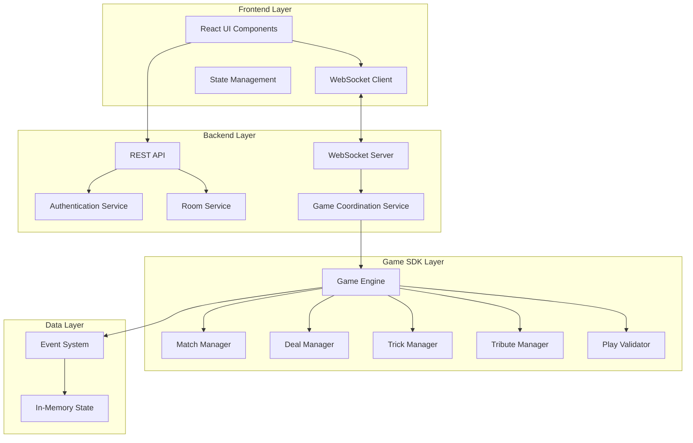

# Design Document

## Overview

掼蛋在线对战平台采用分层架构设计，将游戏逻辑完全封装在独立的SDK中，通过事件驱动的方式与Web服务层进行通信。系统支持四人在线对战，提供完整的用户管理、房间管理、实时游戏体验。

### 核心设计原则

1. **游戏逻辑与服务分离**: 所有掼蛋游戏规则和状态管理都在SDK中实现，Web服务层仅负责协调和通信
2. **事件驱动架构**: 使用事件系统实现松耦合的组件通信
3. **状态一致性**: 通过单一数据源确保游戏状态的一致性
4. **实时性**: 基于WebSocket实现低延迟的实时游戏体验
5. **容错性**: 支持断线重连和自动托管机制

## Architecture

### 系统架构图



### 分层职责

#### Frontend Layer (React + TypeScript)
- **UI Components**: 游戏界面渲染和用户交互
- **WebSocket Client**: 实时通信管理
- **State Management**: 客户端状态管理和同步

#### Backend Layer (Go)
- **REST API**: 用户认证、房间管理等HTTP接口
- **WebSocket Server**: 实时消息路由和广播
- **Game Coordination Service**: 纯协调服务，不包含游戏逻辑

#### Game SDK Layer (Go)
- **Game Engine**: 游戏生命周期管理和事件协调
- **各种Manager**: 专门的游戏组件管理器
- **Event System**: 事件驱动的状态变更通知

## Components and Interfaces

### 核心组件设计

#### 1. Game Engine (游戏引擎)

```go
type GameEngineInterface interface {
    // 生命周期管理
    StartMatch(players []Player) error
    StartDeal() error
    
    // 游戏操作
    PlayCards(playerSeat int, cards []*Card) (*GameEvent, error)
    PassTurn(playerSeat int) (*GameEvent, error)
    
    // 贡牌操作
    ProcessTributePhase() (*TributeAction, error)
    SubmitTributeSelection(playerID int, cardID string) error
    SubmitReturnTribute(playerID int, cardID string) error
    
    // 状态查询
    GetGameState() *GameState
    GetPlayerView(playerSeat int) *PlayerGameState
    GetCurrentTurnInfo() *TurnInfo
    
    // 事件处理
    RegisterEventHandler(eventType GameEventType, handler GameEventHandler)
    ProcessTimeouts() []*GameEvent
    
    // 玩家管理
    HandlePlayerDisconnect(playerSeat int) (*GameEvent, error)
    HandlePlayerReconnect(playerSeat int) (*GameEvent, error)
}
```

**设计特点**:
- 完全自治的游戏状态管理
- 事件驱动的状态变更通知
- 支持玩家视角的状态过滤
- 内置超时和断线处理

#### 2. WebSocket Message System (消息系统)

```go
type WSMessage struct {
    Type      string      `json:"type"`
    Data      interface{} `json:"data"`
    Timestamp time.Time   `json:"timestamp"`
    PlayerID  string      `json:"player_id,omitempty"`
}

// 消息类型定义
const (
    // 房间管理
    MSG_JOIN_ROOM    = "join_room"
    MSG_LEAVE_ROOM   = "leave_room"
    MSG_START_GAME   = "start_game"
    
    // 游戏操作
    MSG_PLAY_CARDS   = "play_cards"
    MSG_PASS_TURN    = "pass_turn"
    MSG_TRIBUTE_SELECT = "tribute_select"
    MSG_TRIBUTE_RETURN = "tribute_return"
    
    // 状态同步
    MSG_GAME_STATE   = "game_state"
    MSG_PLAYER_VIEW  = "player_view"
    MSG_ROOM_UPDATE  = "room_update"
)
```

#### 3. Room Management System (房间管理)

```go
type Room struct {
    ID          string    `json:"id"`
    Status      RoomStatus `json:"status"`
    Players     [4]*Player `json:"players"`
    Owner       string    `json:"owner"`
    GameEngine  *GameEngine `json:"-"`
    CreatedAt   time.Time `json:"created_at"`
}

type RoomService interface {
    CreateRoom(ownerID string) (*Room, error)
    JoinRoom(roomID, playerID string) error
    LeaveRoom(roomID, playerID string) error
    ListRooms(page, limit int) ([]*Room, error)
    StartGame(roomID, playerID string) error
}
```

#### 4. Authentication System (认证系统)

```go
type AuthService interface {
    Register(username, password string) (*User, error)
    Login(username, password string) (*AuthToken, error)
    ValidateToken(token string) (*User, error)
    Logout(token string) error
}

type User struct {
    ID       string `json:"id"`
    Username string `json:"username"`
    Online   bool   `json:"online"`
}

type AuthToken struct {
    Token     string    `json:"token"`
    ExpiresAt time.Time `json:"expires_at"`
    UserID    string    `json:"user_id"`
}
```

## Data Models

### 游戏状态模型

#### 1. Match (比赛)
```go
type Match struct {
    ID          string      `json:"id"`
    Status      MatchStatus `json:"status"`
    Players     [4]*Player  `json:"players"`
    CurrentDeal *Deal       `json:"current_deal"`
    DealHistory []*Deal     `json:"deal_history"`
    TeamLevels  [2]int      `json:"team_levels"`
    Winner      int         `json:"winner"`
    StartTime   time.Time   `json:"start_time"`
    EndTime     *time.Time  `json:"end_time,omitempty"`
}
```

#### 2. Deal (牌局)
```go
type Deal struct {
    ID           string        `json:"id"`
    Level        int           `json:"level"`
    Status       DealStatus    `json:"status"`
    CurrentTrick *Trick        `json:"current_trick"`
    TrickHistory []*Trick      `json:"trick_history"`
    TributePhase *TributePhase `json:"tribute_phase,omitempty"`
    PlayerCards  [4][]*Card    `json:"player_cards"`
    Rankings     []int         `json:"rankings"`
    StartTime    time.Time     `json:"start_time"`
    EndTime      *time.Time    `json:"end_time,omitempty"`
}
```

#### 3. Trick (轮次)
```go
type Trick struct {
    ID          string        `json:"id"`
    Leader      int           `json:"leader"`
    CurrentTurn int           `json:"current_turn"`
    Plays       []*PlayAction `json:"plays"`
    Winner      int           `json:"winner"`
    LeadComp    CardComp      `json:"lead_comp"`
    Status      TrickStatus   `json:"status"`
    StartTime   time.Time     `json:"start_time"`
    TurnTimeout time.Time     `json:"turn_timeout"`
}
```

### 用户和房间模型

#### 1. Player (玩家)
```go
type Player struct {
    ID       string `json:"id"`
    Username string `json:"username"`
    Seat     int    `json:"seat"`
    Online   bool   `json:"online"`
    AutoPlay bool   `json:"auto_play"`
}
```

#### 2. Room (房间)
```go
type Room struct {
    ID        string     `json:"id"`
    Status    RoomStatus `json:"status"`
    Players   [4]*Player `json:"players"`
    Owner     string     `json:"owner"`
    CreatedAt time.Time  `json:"created_at"`
}
```

## Error Handling

### 错误分类和处理策略

#### 1. 游戏规则错误
```go
type GameRuleError struct {
    Code    string `json:"code"`
    Message string `json:"message"`
    Details string `json:"details"`
}

// 错误代码定义
const (
    ERR_INVALID_PLAY     = "INVALID_PLAY"
    ERR_NOT_PLAYER_TURN  = "NOT_PLAYER_TURN"
    ERR_INVALID_CARDS    = "INVALID_CARDS"
    ERR_CANNOT_PASS      = "CANNOT_PASS"
)
```

#### 2. 网络和连接错误
- **断线处理**: 自动标记为托管状态，游戏继续进行
- **重连处理**: 恢复玩家状态，同步当前游戏状态
- **超时处理**: 自动执行Pass或最小牌出牌

#### 3. 系统错误
- **房间不存在**: 返回错误并重定向到大厅
- **权限错误**: 验证用户身份和操作权限
- **状态不一致**: 强制同步游戏状态

### 错误恢复机制

1. **客户端错误恢复**:
   - 自动重连机制
   - 状态同步和恢复
   - 用户友好的错误提示

2. **服务端错误恢复**:
   - 游戏状态快照和恢复
   - 事务性操作确保一致性
   - 日志记录和监控

## Testing Strategy

### 测试层次和策略

#### 1. 单元测试 (Unit Tests)
- **SDK组件测试**: 每个游戏组件的独立功能测试
- **业务逻辑测试**: 掼蛋规则和状态转换测试
- **工具函数测试**: 牌型识别、比较等工具函数测试

```go
func TestGameEngine_StartMatch(t *testing.T) {
    engine := NewGameEngine()
    players := []Player{
        {ID: "p1", Username: "player1", Seat: 0},
        {ID: "p2", Username: "player2", Seat: 1},
        {ID: "p3", Username: "player3", Seat: 2},
        {ID: "p4", Username: "player4", Seat: 3},
    }
    
    err := engine.StartMatch(players)
    assert.NoError(t, err)
    assert.Equal(t, GameStatusStarted, engine.GetGameState().Status)
}
```

#### 2. 集成测试 (Integration Tests)
- **API端点测试**: REST API和WebSocket接口测试
- **服务集成测试**: 各服务组件间的协作测试
- **数据库集成测试**: 数据持久化和查询测试

#### 3. 端到端测试 (E2E Tests)
- **完整游戏流程测试**: 从登录到游戏结束的完整流程
- **多用户并发测试**: 模拟多个用户同时游戏
- **断线重连测试**: 网络异常情况下的系统行为

#### 4. 性能测试 (Performance Tests)
- **并发用户测试**: 支持的最大并发用户数
- **WebSocket性能测试**: 消息传输延迟和吞吐量
- **内存使用测试**: 长时间运行的内存泄漏检测

### 测试数据和场景

#### 1. 游戏场景测试数据
```go
// 测试用的标准牌局配置
var TestDealConfigs = []struct {
    Name        string
    Level       int
    PlayerCards [4][]*Card
    Expected    DealResult
}{
    {
        Name:  "双下胜利",
        Level: 5,
        // ... 具体的牌配置
    },
}
```

#### 2. 边界条件测试
- 最小/最大牌型组合
- 极端超时情况
- 网络异常场景
- 并发操作冲突

### 自动化测试流程

1. **持续集成**: 每次代码提交自动运行单元测试和集成测试
2. **定期回归测试**: 每日运行完整的端到端测试套件
3. **性能基准测试**: 定期运行性能测试并记录基准数据
4. **测试覆盖率监控**: 维持90%以上的代码覆盖率

## 技术选型说明

### 后端技术栈
- **Go**: 高性能、并发友好的系统编程语言
- **Gorilla WebSocket**: 成熟的WebSocket实现
- **JWT**: 无状态的用户认证方案
- **内存存储**: 游戏状态的高速访问

### 前端技术栈
- **React**: 组件化的用户界面框架
- **TypeScript**: 类型安全的JavaScript超集
- **WebSocket API**: 原生WebSocket客户端
- **CSS Modules**: 模块化的样式管理

### 部署和运维
- **Docker**: 容器化部署
- **Docker Compose**: 本地开发环境
- **Nginx**: 反向代理和静态文件服务
- **日志系统**: 结构化日志记录和监控