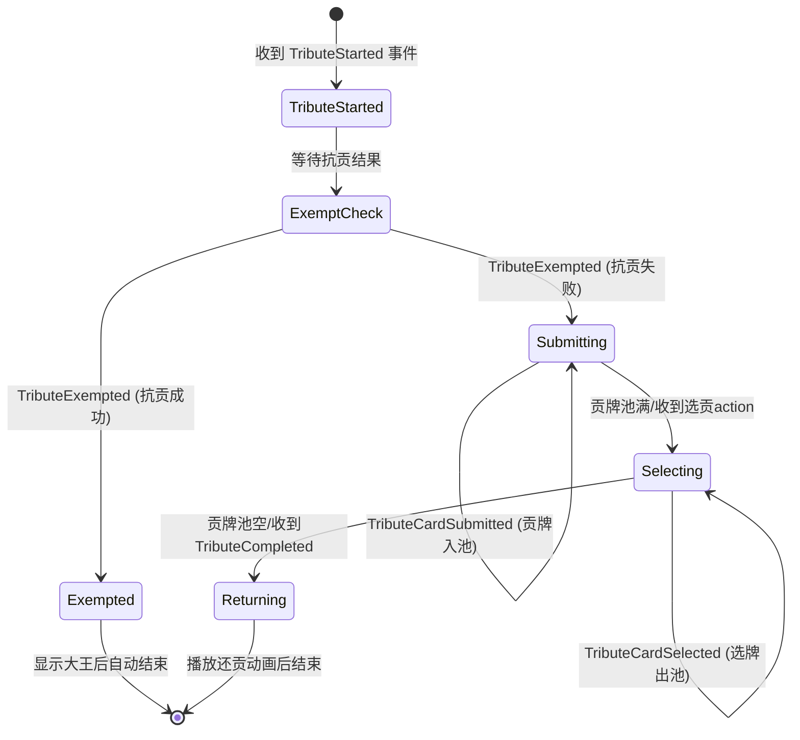

# Tribute 前端逻辑重构实施计划

## 概述

本次重构将完全替换现有的 Tribute 前端实现，从基于定时器的 UI Phase 状态机转变为完全事件驱动的架构。上贡界面复用游戏主界面布局，通过监听后端推送的 Tribute 事件来驱动 UI 状态变化和动画效果。

---

## 重要说明

> **注意**: `player_view` 中的 `tribute_phase` 字段已废弃，**不要使用**。
> 
> Proto 定义 `PlayerView` (view.proto:38-89) 中并没有 `tribute_phase` 字段，前端类型定义中的该字段是旧设计残留。
> 
> Tribute 状态完全通过 `game_event` 中的 Tribute 事件增量构建，参考 `DealResult` / `MatchResult` 的数据通路设计。

---

## 数据通路设计（参考 DealResult / MatchResult）

### DealResult / MatchResult 模式

1. **事件驱动**: 通过 `game_event` 消息的 `EVENT_TYPE_DEAL_ENDED` / `EVENT_TYPE_MATCH_ENDED` 触发
2. **数据存储**: 事件 payload 直接存入 gameStore (`setDealResult(event.dealEnded)`)
3. **数据消费**: 通过 hooks (`useDealResultData`) 聚合 store 数据 + room 数据
4. **组件渲染**: 组件使用 hook 返回的聚合数据

### Tribute 采用相同模式

1. **事件驱动**: 通过多个 Tribute 事件增量更新状态
2. **数据存储**: 独立的 `tributeStore` 管理状态
3. **数据消费**: 通过 `useTributeData` hook 聚合数据
4. **组件渲染**: TributeBoard 使用 hook 返回的数据

---

## 修改点清单

1. **新增 `tributeStore.ts`** - 上贡阶段专用状态管理
2. **新增 `useTributeData.ts`** - 数据聚合 hook（类似 useResultData）
3. **修改 `GamePage.tsx`** - 增加 Tribute 事件处理逻辑，**删除 player_view 中的 tribute_phase 使用**
4. **清理 `types/index.ts`** - 移除 PlayerView/PlayerGameState 中废弃的 `tribute_phase` 字段
5. **重构 `tribute/` 目录** - 新建事件驱动的组件体系
6. **新增 `TributeBoard.tsx`** - 复用 GameBoard 布局的上贡主界面
7. **新增 `TributePool.tsx`** - 贡牌池组件（两个卡位 + 信息区）
8. **新增动画相关工具** - 卡牌飞行动画支持

---

## 修改点详细说明

### 1. 新增 `tributeStore.ts`

**位置**: `frontend/src/store/tributeStore.ts`

**职责**: 存储上贡阶段的完整状态，参考 `dealResult`/`matchResult` 的数据通路模式。

**核心状态结构**:

```typescript
import { create } from 'zustand';
import type { Card } from '../types';
import type { TributeStartedPayload, TributeExemptedPayload, TributeCardReturnedPayload } from '../types/generated/event';

// UI 步骤状态
type TributeStep = 'idle' | 'started' | 'exempted' | 'submitting' | 'selecting' | 'returning' | 'completed';

interface TributeState {
  // 当前步骤
  step: TributeStep;
  
  // 原始事件 payload（直接存储，参考 dealResult/matchResult）
  tributeStarted: TributeStartedPayload | null;
  tributeExempted: TributeExemptedPayload | null;
  
  // 增量状态（从事件累积）
  submittedCards: { [giverSeat: number]: Card };  // giver seat → submitted card
  poolCards: Card[];                               // 贡牌池当前卡牌
  selectedCards: { [receiverSeat: number]: Card }; // receiver seat → selected card
  returnedCards: Array<{
    fromSeat: number;   // receiver (还贡方)
    toSeat: number;     // giver (收还贡方)
    card: Card;
  }>;
  
  // 消息日志
  messages: string[];
}

interface TributeActions {
  // 事件处理方法
  handleTributeStarted: (payload: TributeStartedPayload) => void;
  handleTributeExempted: (payload: TributeExemptedPayload) => void;
  handleCardSubmitted: (actorSeat: number, card: Card) => void;
  handleCardSelected: (actorSeat: number, card: Card) => void;
  handleCardReturned: (actorSeat: number, payload: TributeCardReturnedPayload) => void;
  handleCompleted: () => void;
  reset: () => void;
}
```

---

### 2. 新增 `useTributeData.ts` hook

**位置**: `frontend/src/hooks/useTributeData.ts`

**职责**: 聚合 tributeStore 数据 + room 数据，参考 `useResultData.ts` 设计。

```typescript
import { useTributeStore } from '../store/tributeStore';
import { useRoomStore } from '../store/roomStore';
import { useGameStore } from '../store/gameStore';
import type { Player } from '../types';

export const useTributeData = () => {
  const tributeState = useTributeStore();
  const room = useRoomStore(s => s.currentRoom);
  const playerSeat = useGameStore(s => s.playerSeat);
  
  // 未初始化或无房间数据时返回 null
  if (tributeState.step === 'idle' || !room) return null;
  
  return {
    ...tributeState,
    players: room.players.filter(p => p !== null) as Player[],
    playerSeat
  };
};
```

---

### 3. 修改 `GamePage.tsx` 事件处理

**位置**: `frontend/src/components/game/GamePage.tsx`

**修改内容**:

1. 在 `handleGameEvent` 函数中增加对所有 Tribute 事件的处理
2. **删除 `handlePlayerView` 中对 `playerView.tribute_phase` 的使用**

```diff
+ import { useTributeStore } from '../../store/tributeStore';

// handlePlayerView 函数中删除以下行:
- setTributeInfo(playerView.tribute_phase || null);

// handleGameEvent 函数中增加 Tribute 事件处理:
const handleGameEvent = (message: WSMessage) => {
  const event: GameEvent = message.data as GameEvent;
+ const tributeActions = useTributeStore.getState();
  
  updatePhaseFromEvent(event, setCurrentPhase);

  switch (event.type) {
+   case EventType.EVENT_TYPE_TRIBUTE_STARTED:
+     tributeActions.handleTributeStarted(event.tributeStarted);
+     break;
+     
+   case EventType.EVENT_TYPE_TRIBUTE_EXEMPTED:
+     tributeActions.handleTributeExempted(event.tributeExempted);
+     break;
+     
+   case EventType.EVENT_TYPE_TRIBUTE_CARD_SUBMITTED:
+     tributeActions.handleCardSubmitted(event.actorSeat, event.tributeCardSubmitted.submittedCard);
+     break;
+     
+   case EventType.EVENT_TYPE_TRIBUTE_CARD_SELECTED:
+     tributeActions.handleCardSelected(event.actorSeat, event.tributeCardSelected.selectedCard);
+     break;
+     
+   case EventType.EVENT_TYPE_TRIBUTE_CARD_RETURNED:
+     tributeActions.handleCardReturned(event.actorSeat, event.tributeCardReturned);
+     break;
+     
    case EventType.EVENT_TYPE_TRIBUTE_COMPLETED:
-     setTributeInfo(null);
+     tributeActions.handleCompleted();
      break;
    // ... 其他事件处理
  }
};
```

---

### 4. 清理废弃的类型定义

**位置**: `frontend/src/types/index.ts`

**修改内容**: 删除 `PlayerView` 和 `PlayerGameState` 中废弃的 `tribute_phase` 字段

```diff
export interface PlayerView {
  player_seat: number;
  player_cards: Card[];
  // ...其他字段
- tribute_phase?: TributePhase;  // 删除：已废弃，proto 中无此字段
}

export interface PlayerGameState {
  // ...其他字段
- tribute_phase?: TributePhase;  // 删除：已废弃，proto 中无此字段
}
```

---

### 5. 新增 `TributeBoard.tsx` 主界面组件

**位置**: `frontend/src/components/game/tribute/TributeBoard.tsx`

**职责**: 复用 GameBoard 的布局结构，4个玩家按座次排列，中央为贡牌池。

**核心结构**:

```
┌─────────────────────────────────────────┐
│              [对家玩家]                  │
│               收贡/进贡                  │
│                                         │
│  [左家]     ┌─────────────┐     [右家]  │
│  收贡/进贡  │  贡牌池区域   │    收贡/进贡 │
│            │  [卡位1][卡位2]│            │
│            │  ─────────────│            │
│            │  进贡类型: 双下 │            │
│            │  上贡: 0,2→1,3│            │
│            └─────────────┘            │
│                                         │
│              [当前玩家]                  │
│               收贡/进贡                  │
└─────────────────────────────────────────┘
```

**关键实现**:
- 复用 `GameBoard` 中的 `PlayerArea` 组件样式
- 玩家座位旁增加角色标签（进贡/收贡）
- 中央区域替换为 `TributePool` 组件

---

### 6. 新增 `TributePool.tsx` 贡牌池组件

**位置**: `frontend/src/components/game/tribute/TributePool.tsx`

**职责**: 显示贡牌池（两个固定卡位）和下方信息区。

**Props 定义**:

```typescript
interface TributePoolProps {
  poolCards: Card[];           // 贡牌池中的卡牌（0-2张）
  canSelect: boolean;          // 当前玩家是否可以选牌
  onSelectCard: (card: Card) => void;
  tributeType: TributeType;    // 进贡类型
  messages: string[];          // 信息区消息列表
}
```

**布局结构**:

```
┌─────────────────────────────────┐
│     进贡类型: 双下              │  ← 贡牌池上方
├─────────────────────────────────┤
│   ┌─────┐     ┌─────┐         │
│   │卡位1│     │卡位2│         │  ← 两个固定卡位
│   └─────┘     └─────┘         │
├─────────────────────────────────┤
│  胜利类型: 双下                 │
│  上贡: 玩家0, 玩家2            │  ← 信息区
│  收贡: 玩家1, 玩家3            │
│  玩家0 提交了贡牌 ♠A           │
└─────────────────────────────────┘
```

**交互行为**:
- 当 `canSelect=true` 时，卡牌可点击，hover 时有高亮效果
- 点击卡牌触发 `onSelectCard` 回调

---

### 7. 事件驱动的UI状态流转

**状态流转图**:



***

### 8. 各事件的UI处理逻辑

#### TributeStarted

```typescript
// 1. 初始化 tributeStore
// 2. 在玩家座位旁显示角色标签
// 3. 信息区显示:
//    - 胜利类型: {victoryType}
//    - 上贡: {givers玩家名}
//    - 收贡: {receivers玩家名}
```

#### TributeExempted

```typescript
// 收到该Event表示抗贡成功:
// 1. 在 bigJokerHolders 对应座位显示大王卡牌
// 2. 信息区显示: "{玩家名}拥有{n}张大王；抗贡成功"

```

#### TributeCardSubmitted

```typescript
// 收到该EVENT表示抗贡失败:
// 1. 信息区显示: "抗贡失败；开始进贡"

// 2. 触发卡牌飞行动画: actor_seat 玩家位置 → 贡牌池
// 3. 动画结束后, 将卡牌添加到 poolCards
// 4. 信息区追加: "{玩家名}提交了贡牌{cardName}"
```

#### TributeCardSelected

```typescript
// 1. 触发卡牌飞行动画: 贡牌池 → actor_seat 玩家位置
// 2. 动画结束后, 从 poolCards 移除该卡牌
// 3. 信息区追加: "{玩家名}选择了贡牌{cardName}"
```

#### TributeCompleted

```typescript
// 1. 根据 returnInfo 播放还贡动画
//    - 每张还贡牌从 fromSeat 飞向 toSeat
// 2. 所有动画完成后, 清空 tributeStore
// 3. 切换到 PLAYING 阶段
```

***

### 9. 卡牌飞行动画实现

**位置**: `frontend/src/components/game/tribute/CardFlyAnimation.tsx`

**实现方式**: 使用 CSS `transform` + `transition` 实现平滑飞行效果。

```typescript
interface CardFlyAnimationProps {
  card: Card;
  fromPosition: { x: number; y: number };
  toPosition: { x: number; y: number };
  duration?: number;  // 默认 500ms
  onComplete: () => void;
}
```

**动画流程**:

1. 在 `fromPosition` 渲染卡牌
2. 下一帧设置 `transform: translate(deltaX, deltaY)`
3. `transition` 结束后调用 `onComplete`

***

### 10. 删除的旧代码

**完全删除以下文件**:

* `frontend/src/components/game/tribute/TributeFlow.tsx`

* `frontend/src/components/game/tribute/TributePhaseContent.tsx`

* `frontend/src/components/game/tribute/phaseConfigs.tsx`

* `frontend/src/components/game/tribute/contents.tsx`

**保留并修改**:

* `frontend/src/components/game/tribute/types.ts` - 更新类型定义

***

## 影响范围

| 组件/模块                  | 变更类型 | 说明                                 |
| ---------------------- | ---- | ---------------------------------- |
| `tributeStore.ts`      | 新增   | 上贡状态管理（独立 store）                   |
| `useTributeData.ts`    | 新增   | 数据聚合 hook（参考 useResultData）        |
| `GamePage.tsx`         | 修改   | 增加事件处理，删除 player_view.tribute_phase 使用 |
| `types/index.ts`       | 修改   | 删除废弃的 tribute_phase 字段             |
| `gameStore.ts`         | 修改   | 删除 tributeInfo 相关状态（迁移到 tributeStore）|
| `TributeBoard.tsx`     | 新增   | 上贡主界面                              |
| `TributePool.tsx`      | 新增   | 贡牌池组件                              |
| `CardFlyAnimation.tsx` | 新增   | 飞行动画组件                             |
| `tribute/types.ts`     | 修改   | 更新类型定义                             |
| 旧 tribute 组件           | 删除   | TributeFlow, TributePhaseContent 等 |
| `converters.ts`        | 修改   | 可删除 convertProtoTributeView（不再使用）  |
