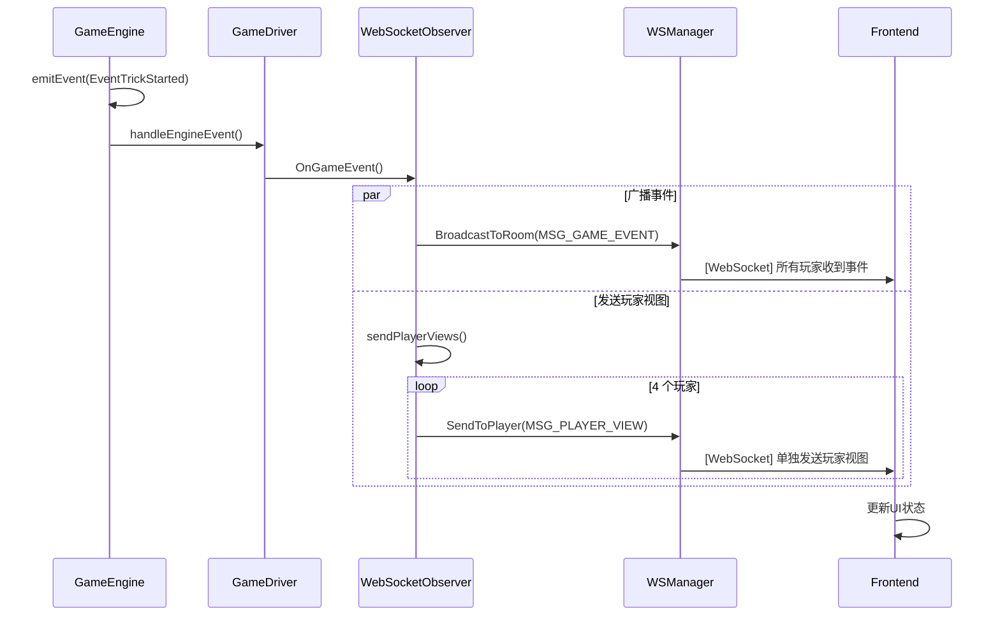

# 游戏引擎事件系统架构分析

## 一、事件类型概览

### 1. 比赛生命周期事件
| 事件类型 | 触发时机 | 数据内容 | 接收对象 |
|---------|---------|---------|---------|
| **EventMatchStarted** | `StartMatch()` 成功创建比赛 | match 对象 | 所有玩家 |
| **EventMatchEnded** | 某队伍到达 A 级别 | match、result、winner、final_levels | 所有玩家 |

### 2. 牌局（Deal）生命周期事件
| 事件类型 | 触发时机 | 数据内容 | 接收对象 |
|---------|---------|---------|---------|
| **EventDealStarted** | `StartDeal()` 发牌后 | deal、deal_level、team0_level、team1_level | 所有玩家 |
| **EventDealEnded** | 玩家全部出完牌 | deal、result、rankings、statistics | 所有玩家 |

### 3. 上贡阶段事件
| 事件类型 | 触发时机 | 数据内容 | 接收对象 |
|---------|---------|---------|---------|
| **EventTributeRulesSet** | `StartDeal()` 后判定上贡规则 | last_result、victory_type、tribute_rules、player_rankings | 所有玩家 |
| **EventTributeImmunity** | 判定免贡（红桃主或其他） | tribute_phase、immunity_reason | 所有玩家 |
| **EventTributePoolCreated** | 双下场景，贡牌池创建完成 | contributors、selection_order、pool_cards、selecting_player | 所有玩家 |
| **EventTributeGiven** | 上贡牌自动选择完成 | giver、receiver、card、tribute_type、selection_reason | 所有玩家 |
| **EventTributeSelected** | 玩家从贡牌池选牌完成 | player、cardID、selected_card、remaining_options、selection_order | 所有玩家 |
| **EventReturnTribute** | 玩家还贡完成 | player、cardID、return_card、target_player、original_tribute | 所有玩家 |
| **EventTributeCompleted** | 上贡阶段完全结束 | tribute_phase | 所有玩家 |

### 4. 出牌阶段（Trick）事件
| 事件类型 | 触发时机 | 数据内容 | 接收对象 |
|---------|---------|---------|---------|
| **EventTrickStarted** | 新的 trick 开始（pre-action） | trick、leader、current_turn、player_hands | 所有玩家 |
| **EventPlayerPlayed** | 玩家出牌 | player_seat、cards、deal_state | 所有玩家 |
| **EventPlayerPassed** | 玩家过牌 | player_seat、deal_state | 所有玩家 |
| **EventTrickEnded** | trick 结束（post-action） | trick、winner、next_leader | 所有玩家 |

### 5. 玩家状态事件
| 事件类型 | 触发时机 | 数据内容 | 接收对象 |
|---------|---------|---------|---------|
| **EventPlayerTimeout** | 玩家操作超时 | action、phase | 所有玩家 |
| **EventPlayerDisconnect** | 玩家断线 | player_seat、auto_play | 所有玩家 |
| **EventPlayerReconnect** | 玩家重连 | player_seat、auto_play | 所有玩家 |

---

## 二、事件发送流程架构

### 架构层次图

```
┌─────────────────────────────────────────────────────────────┐
│                     Frontend (React)                         │
│  - 接收并展示事件                                              │
│  - 根据事件更新UI状态                                          │
└────────────────────────┬────────────────────────────────────┘
                         │ WebSocket (双向)
                         │
┌────────────────────────▼────────────────────────────────────┐
│              WebSocket Manager (backend/websocket)           │
│  - 管理 WebSocket 连接                                        │
│  - 消息路由和分发                                              │
│  - MSG_GAME_EVENT: 广播所有玩家                               │
│  - MSG_PLAYER_VIEW: 单播特定玩家                              │
│  - MSG_GAME_ACTION: 请求玩家操作                              │
└────────────────────────▲────────────────────────────────────┘
                         │
┌────────────────────────┴────────────────────────────────────┐
│          WebSocketObserver (backend/game/driver_service.go)  │
│  - 实现 sdk.EventObserver 接口                               │
│  - 将 SDK 事件转换为 WebSocket 消息                           │
│  - 为关键事件发送 player_view（带过滤）                        │
└────────────────────────▲────────────────────────────────────┘
                         │
┌────────────────────────┴────────────────────────────────────┐
│              GameDriver (sdk/game_driver.go)                 │
│  - 注册所有事件类型                                            │
│  - handleEngineEvent() 转发事件给所有 observers               │
│  - notifyObservers() 同步/异步通知                            │
└────────────────────────▲────────────────────────────────────┘
                         │
┌────────────────────────┴────────────────────────────────────┐
│              GameEngine (sdk/game_engine.go)                 │
│  - emitEvent() 发出事件                                       │
│  - 在状态变化时触发事件                                        │
│  - 支持多个 handler 订阅同一事件                               │
└─────────────────────────────────────────────────────────────┘
```

### 事件流转详细步骤

#### 步骤 1：GameEngine 发送事件
```go
// game_engine.go
func (ge *GameEngine) emitEvent(event *GameEvent) {
    handlers, exists := ge.eventHandlers[event.Type]
    if !exists {
        return
    }
    
    // 异步调用所有注册的处理器（防止死锁）
    for _, handler := range handlers {
        h := handler
        go func() {
            defer func() {
                if r := recover(); r != nil {
                    fmt.Printf("Event handler panic for %s: %v\n", event.Type, r)
                }
            }()
            h(event)
        }()
    }
}
```

**特点**：
- ✅ **异步执行**：每个 handler 在独立 goroutine 中运行
- ✅ **错误隔离**：panic recovery 防止单个 handler 崩溃影响引擎
- ⚠️ **无序保证**：异步执行可能导致事件处理顺序不可控

#### 步骤 2：GameDriver 注册和转发
```go
// game_driver.go - RunMatch()
gd.engine.RegisterEventHandler(EventMatchStarted, gd.handleEngineEvent)
gd.engine.RegisterEventHandler(EventDealStarted, gd.handleEngineEvent)
// ... 注册所有事件类型

func (gd *GameDriver) handleEngineEvent(event *GameEvent) {
    gd.notifyObservers(event)
}

func (gd *GameDriver) notifyObservers(event *GameEvent) {
    for _, observer := range gd.observers {
        if gd.config.AsyncEventHandling {
            go observer.OnGameEvent(event)  // 异步
        } else {
            observer.OnGameEvent(event)     // 同步
        }
    }
}
```

**配置项**：
- `AsyncEventHandling = false`（默认）：**同步处理确保顺序**
- `AsyncEventHandling = true`：异步处理提升性能

#### 步骤 3：WebSocketObserver 处理
```go
// backend/game/driver_service.go
func (wso *WebSocketObserver) OnGameEvent(event *sdk.GameEvent) {
    // 1. 广播事件给所有玩家
    wsMessage := &websocket.WSMessage{
        Type: websocket.MSG_GAME_EVENT,
        Data: map[string]interface{}{
            "event_type":  string(event.Type),
            "event_data":  event.Data,
            "timestamp":   event.Timestamp,
            "player_seat": event.PlayerSeat,
        },
        Timestamp: event.Timestamp,
    }
    wso.wsManager.BroadcastToRoom(wso.roomID, wsMessage)
    
    // 2. 为关键事件发送玩家视图（player_view）
    switch event.Type {
    case sdk.EventMatchStarted, sdk.EventDealStarted, 
         sdk.EventPlayerPlayed, sdk.EventTributeCompleted:
        wso.sendPlayerViews(event.Type)
    }
}
```

**双重消息机制**：
1. **MSG_GAME_EVENT**（广播）：所有玩家收到相同的公共事件
2. **MSG_PLAYER_VIEW**（单播）：每个玩家收到过滤后的私有状态

#### 步骤 4：WebSocket Manager 分发
```go
// backend/websocket/manager.go
func (m *WSManager) BroadcastToRoom(roomID string, message *WSMessage) {
    // 发送给房间内所有玩家
}

func (m *WSManager) SendToPlayer(playerID string, message *WSMessage) {
    // 发送给特定玩家
}
```

---

## 三、关键事件触发时机详解

### 3.1 State Transition 检查机制

GameEngine 使用 **pre-action** 和 **post-action** 检查来触发状态转换事件：

```go
// PlayCards() / PassTurn() 的执行流程
func (ge *GameEngine) PlayCards(playerSeat int, cards []*Card) (*GameEvent, error) {
    // 1. PRE-ACTION: 检查 trick 是否需要启动
    preEvents := ge.checkPreActionStateTransitions()
    for _, evt := range preEvents {
        ge.emitEvent(evt)  // 发送 EventTrickStarted
    }
    
    // 2. 执行动作
    deal.PlayCards(playerSeat, cards)
    ge.emitEvent(EventPlayerPlayed)
    
    // 3. POST-ACTION: 检查 trick/deal 是否结束
    postEvents := ge.checkPostActionStateTransitions()
    for _, evt := range postEvents {
        ge.emitEvent(evt)  // 发送 EventTrickEnded / EventDealEnded / EventMatchEnded
    }
    
    return event, nil
}
```

#### Pre-Action 检查
- **检查内容**：trick 是否处于 `TrickStatusWaiting`
- **触发事件**：`EventTrickStarted`
- **包含数据**：trick、leader、current_turn、**player_hands（所有玩家手牌快照）**

#### Post-Action 检查
- **检查内容**：
  1. Deal 是否已完成（`DealStatusFinished`）
  2. Trick 是否已完成（`TrickStatusFinished`）
- **触发事件**：
  - `EventTrickEnded` → 创建新 trick
  - `EventDealEnded` → 计算结果、更新比赛状态
  - `EventMatchEnded`（如果比赛结束）

### 3.2 上贡阶段事件链

```
StartDeal()
    │
    ├─→ EventDealStarted
    │
    ├─→ EventTributeRulesSet (如果有上贡规则)
    │
    ├─→ EventTributeImmunity (如果免贡)
    │
ProcessTributePhase() [循环调用]
    │
    ├─→ EventTributePoolCreated (双下场景)
    │   
    ├─→ EventTributeGiven (自动上贡完成)
    │
    ├─→ [等待玩家输入] RequestTributeSelection / RequestReturnTribute
    │
    ├─→ EventTributeSelected (玩家选牌)
    │
    ├─→ EventReturnTribute (玩家还贡)
    │
    └─→ EventTributeCompleted (贡牌完成)
         │
         └─→ 启动 Playing 阶段
```

**关键点**：
- `ProcessTributePhase()` 返回 `TributeAction` 表示需要玩家输入
- GameDriver 调用 `inputProvider.RequestXXX()` 等待玩家操作
- 玩家提交后，引擎继续处理并发送后续事件

### 3.3 出牌阶段事件链

```
[新 Trick]
    │
    ├─→ PlayCards() / PassTurn()
    │   │
    │   ├─→ EventTrickStarted (PRE)
    │   │
    │   ├─→ EventPlayerPlayed / EventPlayerPassed
    │   │
    │   └─→ EventTrickEnded (POST，如果 trick 结束)
    │
    ├─→ [继续下一轮]
    │
    └─→ EventDealEnded (所有玩家出完牌)
         │
         └─→ EventMatchEnded (如果比赛结束)
```

---

## 四、架构优缺点分析

### ✅ 优点

#### 1. **分层清晰**
- **SDK 层**：纯游戏逻辑，无网络依赖
- **Backend 层**：负责网络通信和房间管理
- **观察者模式**：解耦事件发送和接收

#### 2. **事件类型丰富**
- 覆盖游戏全生命周期（比赛、牌局、trick、上贡）
- 细粒度事件（如 `TributeGiven` vs `TributeSelected`）
- 支持玩家状态事件（超时、断线、重连）

#### 3. **错误隔离**
- 事件处理器在独立 goroutine 中运行
- Panic recovery 防止崩溃传播
- 异步处理不阻塞游戏主流程

#### 4. **视图过滤机制**
- `MSG_PLAYER_VIEW` 实现私有信息过滤
- 使用 `engine.GetPlayerView()` 获取玩家视角状态
- 避免泄露其他玩家手牌

#### 5. **State Transition 自动检测**
- Pre/Post-action 检查自动触发状态转换事件
- 减少手动事件发送的遗漏

---

### ⚠️ 存在的问题

#### 问题 1：事件顺序不可控（严重）

**问题描述**：
- `emitEvent()` 使用 `go func()` 异步调用所有 handler
- 多个事件快速发送时，前端可能收到乱序

**示例场景**：
```go
// 快速连续发送
ge.emitEvent(EventTrickEnded)       // 事件 A
ge.emitEvent(EventTrickStarted)     // 事件 B
ge.emitEvent(EventPlayerPlayed)     // 事件 C

// 前端可能收到: B → A → C（乱序！）
```

**影响**：
- 前端状态机混乱
- UI 展示错误（如显示错误的 trick winner）

**建议修复**：
```go
// 方案 1：同步发送事件（改为串行）
func (ge *GameEngine) emitEvent(event *GameEvent) {
    handlers, exists := ge.eventHandlers[event.Type]
    if !exists {
        return
    }
    
    for _, handler := range handlers {
        handler(event)  // 同步调用
    }
}

// 方案 2：使用事件队列保证顺序
type GameEngine struct {
    eventQueue chan *GameEvent
}

func (ge *GameEngine) emitEvent(event *GameEvent) {
    ge.eventQueue <- event  // 加入队列
}

func (ge *GameEngine) eventDispatcher() {
    for event := range ge.eventQueue {
        handlers := ge.eventHandlers[event.Type]
        for _, handler := range handlers {
            handler(event)  // 按队列顺序处理
        }
    }
}
```

#### 问题 2：事件数据冗余

**问题描述**：
- `EventTrickStarted` 包含 `player_hands`（所有玩家手牌）
- 通过 `MSG_GAME_EVENT` 广播时，泄露了私有信息

**代码位置**：
```go
// game_engine.go:796
playerHands := make(map[int][]*Card)
for i := 0; i < 4; i++ {
    if deal.PlayerCards[i] != nil {
        handCopy := make([]*Card, len(deal.PlayerCards[i]))
        copy(handCopy, deal.PlayerCards[i])
        playerHands[i] = handCopy  // 包含所有玩家手牌！
    }
}
```

**影响**：
- 安全风险：前端 JS 可以访问其他玩家手牌
- 网络浪费：不必要的数据传输

**建议修复**：
```go
// 方案 1：移除 player_hands 字段
trickStartedEvent := &GameEvent{
    Type: EventTrickStarted,
    Data: map[string]interface{}{
        "trick":        deal.CurrentTrick,
        "leader":       deal.CurrentTrick.Leader,
        "current_turn": deal.CurrentTrick.CurrentTurn,
        // 移除 "player_hands": playerHands,
    },
    Timestamp: time.Now(),
}

// 方案 2：在 WebSocketObserver 中过滤敏感数据
func (wso *WebSocketObserver) OnGameEvent(event *sdk.GameEvent) {
    // 克隆事件数据并移除敏感信息
    eventData := filterSensitiveData(event.Data)
    
    wsMessage := &websocket.WSMessage{
        Type: websocket.MSG_GAME_EVENT,
        Data: map[string]interface{}{
            "event_type": string(event.Type),
            "event_data": eventData,  // 已过滤
        },
    }
    wso.wsManager.BroadcastToRoom(wso.roomID, wsMessage)
}
```

#### 问题 3：Player View 发送频率过高

**问题描述**：
- 每个关键事件都发送 `MSG_PLAYER_VIEW`（4 条单播）
- 一次出牌可能触发多个事件（TrickStarted + PlayerPlayed + TrickEnded）

**代码位置**：
```go
// driver_service.go:598-611
switch event.Type {
case sdk.EventMatchStarted,      // 所有这些事件都发送 player_view
     sdk.EventDealStarted,
     sdk.EventPlayerPlayed,
     sdk.EventTrickEnded,
     // ... 共 10 种事件
    wso.sendPlayerViews(event.Type)
}
```

**示例**：
- 玩家 A 出牌 → `EventTrickStarted` (4 条) + `EventPlayerPlayed` (4 条) = **8 条消息**
- 4 个玩家 × 每局 50 轮 = **1600 条 player_view 消息/局**

**建议优化**：
```go
// 方案 1：合并连续的 player_view 更新（延迟发送）
type WebSocketObserver struct {
    roomID        string
    wsManager     WSManagerInterface
    engine        sdk.GameEngineInterface
    pendingUpdate map[string]bool  // 待发送的 player_view
    updateTimer   *time.Timer
}

func (wso *WebSocketObserver) OnGameEvent(event *sdk.GameEvent) {
    // 广播事件
    wso.wsManager.BroadcastToRoom(wso.roomID, wsMessage)
    
    // 标记需要更新 player_view，但延迟发送
    wso.pendingUpdate[wso.roomID] = true
    wso.schedulePlayerViewUpdate()
}

func (wso *WebSocketObserver) schedulePlayerViewUpdate() {
    if wso.updateTimer != nil {
        wso.updateTimer.Stop()
    }
    wso.updateTimer = time.AfterFunc(50*time.Millisecond, func() {
        if wso.pendingUpdate[wso.roomID] {
            wso.sendPlayerViews(sdk.EventType("batch_update"))
            delete(wso.pendingUpdate, wso.roomID)
        }
    })
}

// 方案 2：只在手牌变化时发送 player_view
case sdk.EventPlayerPlayed,      // 手牌减少
     sdk.EventTributeGiven,      // 手牌减少
     sdk.EventReturnTribute,     // 手牌增加
     sdk.EventTributeCompleted:  // 手牌调整完成
    wso.sendPlayerViews(event.Type)
```

#### 问题 4：事件命名不一致

**问题描述**：
- `EventTributeGiven`（已完成） vs `EventTributeSelected`（已完成）
- `EventTrickStarted`（进行中） vs `EventTrickEnded`（已完成）

**建议**：
```go
// 统一命名规范
const (
    // 动作完成事件：Past tense
    EventTributeGiven    = "tribute_given"
    EventTributeSelected = "tribute_selected"
    EventTrickEnded      = "trick_ended"
    
    // 阶段开始事件：Started
    EventTrickStarted    = "trick_started"
    EventDealStarted     = "deal_started"
    
    // 状态变化事件：Passive voice
    EventTributeCompleted = "tribute_completed"
    EventMatchCompleted   = "match_completed"
)
```

#### 问题 5：缺少事件聚合（Deal Summary）

**问题描述**：
- 牌局结束时只有 `EventDealEnded`
- 缺少对整局的统计摘要（如各玩家出牌次数、用时等）

**建议新增事件**：
```go
const (
    EventDealSummary GameEventType = "deal_summary"
)

type DealSummary struct {
    DealID       string
    Winner       int
    VictoryType  VictoryType
    Duration     time.Duration
    PlayerStats  map[int]*PlayerDealStats
    TrickCount   int
}

type PlayerDealStats struct {
    PlayerSeat   int
    CardsPlayed  int
    TricksWon    int
    TotalTime    time.Duration
    TimeoutCount int
}
```

---

## 五、性能优化建议

### 5.1 消息批量发送
当前每个事件立即发送，可以批量合并：

```go
type BatchedMessage struct {
    RoomID    string
    Events    []*sdk.GameEvent
    Timestamp time.Time
}

// 累积 50ms 内的事件后批量发送
func (wso *WebSocketObserver) OnGameEvent(event *sdk.GameEvent) {
    wso.eventBuffer.Add(event)
    
    if wso.batchTimer == nil {
        wso.batchTimer = time.AfterFunc(50*time.Millisecond, func() {
            wso.flushEventBuffer()
        })
    }
}
```

### 5.2 增量状态更新
Player View 包含完整状态，可以只发送变化部分：

```go
type PlayerViewDelta struct {
    PlayerSeat    int
    HandAdded     []*Card  // 新增的牌
    HandRemoved   []string // 移除的牌ID
    TrickChanges  map[string]interface{}
}
```

### 5.3 事件优先级队列
关键事件（如 `EventDealEnded`）应优先发送：

```go
type PriorityEvent struct {
    Event    *sdk.GameEvent
    Priority int
}

const (
    PriorityHigh   = 1  // MatchEnded, DealEnded
    PriorityMedium = 2  // PlayerPlayed, TrickEnded
    PriorityLow    = 3  // TrickStarted
)
```

---

## 六、总结和建议

### 当前架构评分

| 维度 | 评分 | 说明 |
|------|------|------|
| **分层设计** | ⭐⭐⭐⭐⭐ | SDK 与 Backend 分离良好 |
| **事件覆盖** | ⭐⭐⭐⭐⭐ | 事件类型丰富完整 |
| **扩展性** | ⭐⭐⭐⭐ | 观察者模式易于扩展 |
| **性能** | ⭐⭐⭐ | 存在冗余消息和频繁发送 |
| **顺序性** | ⭐⭐ | 异步事件可能乱序 |
| **安全性** | ⭐⭐ | 事件数据包含敏感信息 |

**总体评价**：架构设计清晰合理，但存在一些工程实现问题。

### 核心建议优先级

#### 🔴 高优先级（必须修复）
1. **修复事件顺序问题**：改为同步发送或使用事件队列
2. **移除敏感数据泄露**：`EventTrickStarted` 不应包含所有玩家手牌

#### 🟡 中优先级（建议优化）
3. **减少 Player View 发送频率**：延迟合并或只在手牌变化时发送
4. **统一事件命名规范**：Past tense vs Started vs Completed

#### 🟢 低优先级（长期改进）
5. **实现消息批量发送**：减少网络开销
6. **增量状态更新**：只发送变化部分
7. **新增 Deal Summary 事件**：提供统计摘要

### 参考实现示例

#### 修复 1：保证事件顺序
```go
// sdk/game_engine.go
type GameEngine struct {
    // ... 现有字段
    eventQueue      chan *GameEvent
    eventDispatcher *EventDispatcher
}

type EventDispatcher struct {
    queue    chan *GameEvent
    handlers map[GameEventType][]GameEventHandler
    mu       sync.RWMutex
}

func (ed *EventDispatcher) Start() {
    go func() {
        for event := range ed.queue {
            ed.mu.RLock()
            handlers := ed.handlers[event.Type]
            ed.mu.RUnlock()
            
            // 同步调用所有 handler（保证顺序）
            for _, handler := range handlers {
                handler(event)
            }
        }
    }()
}

func (ge *GameEngine) emitEvent(event *GameEvent) {
    ge.eventQueue <- event  // 进入队列，按顺序处理
}
```

#### 修复 2：移除敏感数据
```go
// backend/game/driver_service.go
func (wso *WebSocketObserver) OnGameEvent(event *sdk.GameEvent) {
    // 克隆并过滤事件数据
    filteredData := wso.filterEventData(event.Type, event.Data)
    
    wsMessage := &websocket.WSMessage{
        Type: websocket.MSG_GAME_EVENT,
        Data: map[string]interface{}{
            "event_type": string(event.Type),
            "event_data": filteredData,
        },
        Timestamp: event.Timestamp,
    }
    wso.wsManager.BroadcastToRoom(wso.roomID, wsMessage)
}

func (wso *WebSocketObserver) filterEventData(eventType sdk.GameEventType, data interface{}) interface{} {
    dataMap, ok := data.(map[string]interface{})
    if !ok {
        return data
    }
    
    // 克隆数据
    filtered := make(map[string]interface{})
    for k, v := range dataMap {
        filtered[k] = v
    }
    
    // 移除敏感字段
    switch eventType {
    case sdk.EventTrickStarted:
        delete(filtered, "player_hands")  // 移除所有玩家手牌
    }
    
    return filtered
}
```

---

## 附录：完整事件流程图



---

**文档版本**：v1.0  
**最后更新**：2025-11-09  
**作者**：AI Assistant

